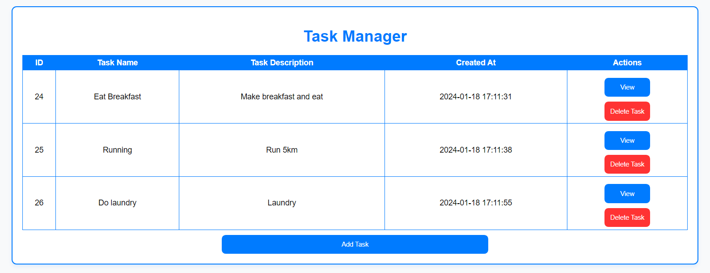
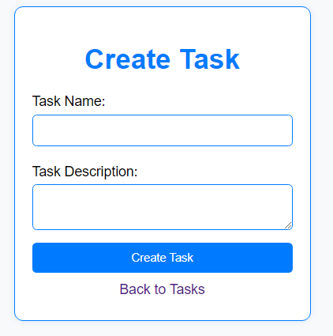
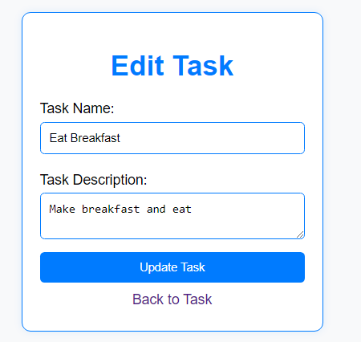
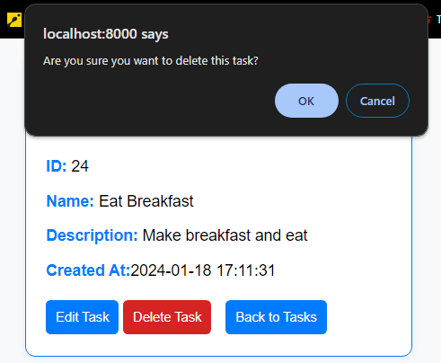

# Task Manager

Task Manager is a simple PHP web application for managing tasks where user can view, create, edit and delete tasks.

## Requirements
* [Git](https://git-scm.com/download/win)
* [MySql](https://www.mysql.com/downloads/)
* [PHP^7.4](https://www.php.net/downloads.php)

## Installation Guide
### Setting up

1. Clone the repository
  `https://github.com/jaiel666/TaskManager.git`
2. Configure the database:
   - Create a MySQL database named `task_manager`.
   - Create a table named `tasks` with following columns
       1. `id (auto-incremented)`
       2. `task_name (VARCHAR)`
       3. `task_description (TEXT)`
       4. `created_at (DATETIME)`
3. Update the database connection details in your `index.php` PHP file.
4. Start the PHP built-in server
   `php -S localhost:8000`
5. Acces the project opening your web browser and go to `http://localhost:8000`

## Database Structure
This command exports the structure of a database without including any data  
`mysqldump -u user -h localhost -p database > database.sql`

## Features
### View Tasks

### Create Tasks

### Edit Tasks

### Delete Tasks

